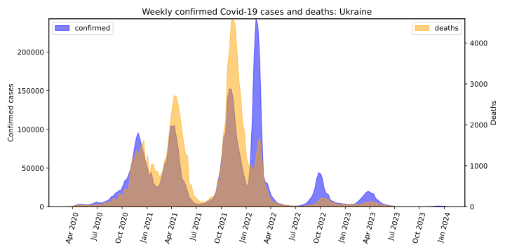
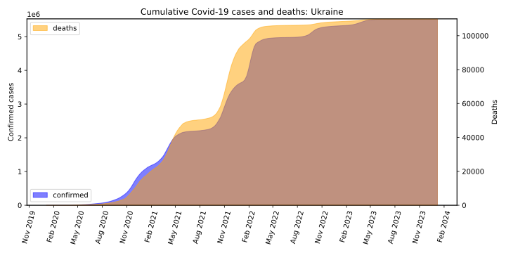
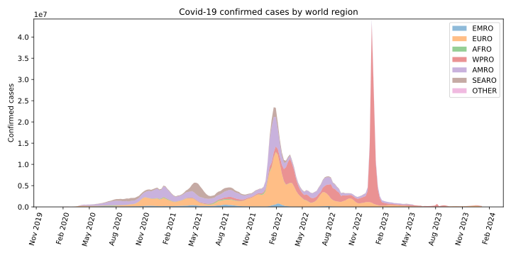

# 🏺 Homework 2 – Visualizing Covid-19 Time Series Data 

The goal of this exercise is to **analyze and visualize the Covid-19 dataset provided by the [World Health Organization (WHO)](https://covid19.who.int/data).**

## Load the data
 
Load the dataset of **weekly confirmed Covid-19 cases and deaths** reported to WHO using the following link:
```bash
url = 'https://srhdpeuwpubsa.blob.core.windows.net/whdh/COVID/WHO-COVID-19-global-data.csv'
```

---

## Task 1: Weekly new cases and deaths

Here you need to create a plot with **new confirmed cases** and **deaths** for a country of your choice using the data till August 1st 2024. 

Your steps can be as follows:
- Filter the data to only include entries before August 1st 2024.
- Choose any country given in the dataset and extract corresponding entries.
- Create a plot of **new cases** with filled area under curve (use ```plt.fill_between``` function).
- Create the same plot for **new deaths**.
    
📌 You have several options to combine the two plots nicely:

- To see the relationship between the curves of confirmed cases and deaths, you can plot the two graphs in the same figure. In this case, you can add a new Y-axis by ```ax.twinx()``` command to have two different value ranges of the Y-axis in the same figure. You may need this because the number of reported deaths is normally much smaller than the number of reported cases.

- Alternatively, you can plot the two curves in two different **subplots**, one under another, using subplots.

---

## Task 2: Cumulative cases and deaths
  Create the same plot as in Task 1 but for cumulative cases and deaths.


---
## Task 3: Confirmed cases by world region

The WHO dataset includes a column specifying the **WHO region** to which each country belongs. Your task is to calculate how much each WHO region contributes to the total number of weekly confirmed Covid-19 cases worldwide.

You can follows this plan:
- Group the data by WHO regions.
- Ensure that the timestamps (days when the cases are reported) are the same for each country and region, and sum the cases per region for each timestamp.
- Stack ```fill_between``` plots for each region on top of each other to create a figure of total world cases with colors indicating the region (see figure examples below).

---
## 🔍 Example Figures

Your plots may differ in style, but should present the same information.

### Task 1


### Task 2


### Task 3

