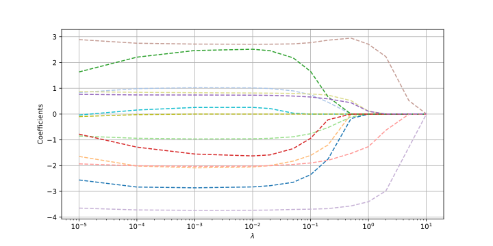
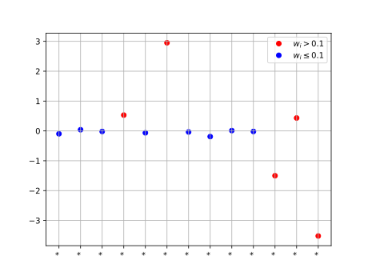

# 🏠 Homework 5 — Lasso on Boston Housing Dataset

In this task, you will implement **Lasso regression** and study its behavior on the [**Boston Housing dataset**](https://www.cs.toronto.edu/~delve/data/boston/bostonDetail.html).

### Data

- Load the dataset from the following URL:  
  [https://raw.githubusercontent.com/selva86/datasets/master/BostonHousing.csv](https://raw.githubusercontent.com/selva86/datasets/master/BostonHousing.csv)

- The target variable is **`MEDV`** (median house value).  
  Use **all other columns** as features.

- Variable descriptions are available [here](https://www.cs.toronto.edu/~delve/data/boston/bostonDetail.html).

### Task 1: Implement Linear Regression

- Create a `LinearRegression` class.
- It should behave similarly to `LinearBinaryClassification`, but calling the class instance should return the decision function value

  $$
  h(x) = \langle w, x \rangle + b
  $$
  instead of the classifier's binary decision.

- Implement training with **gradient descent (GD)**.

### Task 2: Implement Lasso Regression

- Implement a `LassoRegression` class that adds an **$\ell^1$ regularization term** to linear regression.
- As in the lecture, you may assume:

  $$
  \frac{\partial}{\partial w_i} |w_i| = \text{sign}(w_i)
  $$

### Task 3: Explore Regularization Effects

- Train Lasso with a variety of $\lambda$ values.
- Plot the following as functions of $\lambda$ (as we did in class for Ridge regression):
    - Final **train MSE**
    - Final **test MSE**
    - Norm of the coefficients vector $\| w \|_1$

📝 **Goal**: Identify $\lambda$ values that reduce model complexity without significantly hurting performance.

### Task 4: Track Sparsity

- Plot **each coefficient in $w$ as a function of $\lambda$**  
(similar to the plot below):

> 📌 In your notebook, **include the legend** to show which line corresponds to which feature (here it's hidden for the suspence).

### Task 5: Identify Key Features

- Identify the last few variables (e.g., 4–6) that **do not become zero** as $\lambda$ increases.
- Look up and explain what these variables represent.
- Choose a $\lambda$ value that results in a model using **only those active features**.
- Train the model with that $\lambda$ and:
    - Print the coefficient names for the active features and interpret their meaning.
    - Which features **increase** the predicted house price?
     - Which **decrease** it?

Visualize the final active coefficients (as in the example below):

> 📌 Include **variable names on the x-axis** in your plot.