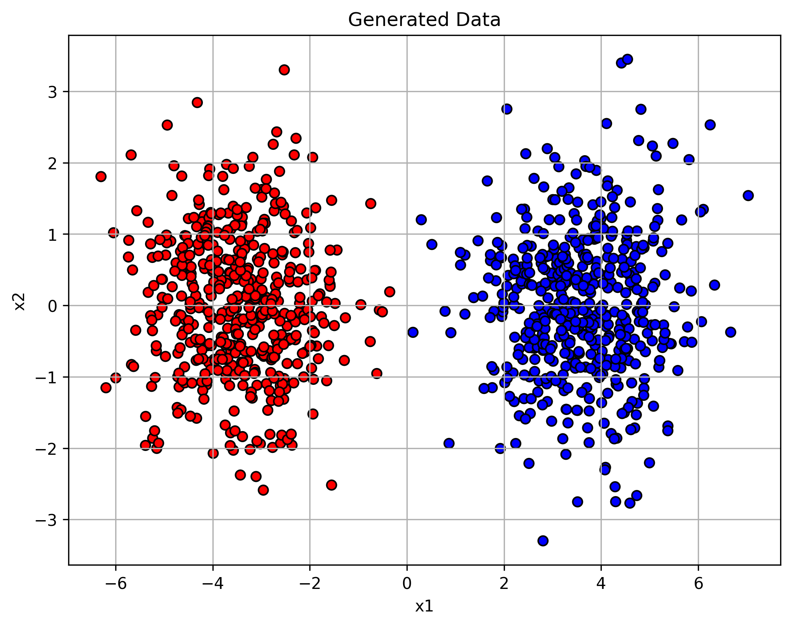

## 📉 Homework 7 — Primal SVM Training with Learning Rate Scheduling

In the lecture, we implemented **gradient descent training** for a **linear SVM** using the *primal objective*. However, you may have noticed a recurring issue:  
> 📉 **Training becomes unstable**, and **accuracy often drops** toward the end.

This happens because a **fixed learning rate** can overshoot the optimum, especially late in training, when the SVM objective depends only on a few support vectors and is therefore highly unstable.

Your task in this homework is to **extend our `GDOptimizer` implementation to support a learning rate scheduling**, and test whether it improves training stability.


### 🛠️ **Task 1: Extend `GDOptimizer`**  
   Modify your optimizer class to accept an optional `schedule_fn`. If provided, it should override the learning rate dynamically at each step.

   Example schedule:

```python
def decay_schedule(step, initial_lr=0.1, decay_rate=0.05):
    return initial_lr / (1 + decay_rate * step)
```
   Your `update()` method should call the schedule (if provided) and update the internal `learning_rate` accordingly.

### 📌 Tips

- Keep your original optimizer behavior unchanged when `schedule_fn=None`.
- Make sure the learning rate updates **after every gradient step**, not just once per epoch.


## 🧪 Dataset: Separated Gaussian Blobs

In this assignment, you'll train your SVM on **synthetic 2D data** generated from two **well-separated Gaussian distributions**. Generate such syntetic dataset, which could look e.g. as follows:




This ensures:
- 💡 The data is nearly **perfectly separable** by a linear classifier
- 📈 Instability during training will likely be due to **optimization**, not the data


### 📊 **Task 2: Track and Compare Training Metrics**

Implement and log the following metrics during training. Add them to your training loop via a `metrics_dict`:

- 🔢 **Loss**: Hinge loss  
- ✅ **Accuracy**: Binary classification accuracy
- 📏 **Mean margin**: $\frac{1}{N}\sum_i y_i \cdot h(x_i) $
- ❌ **Number of margin violations**: $\text{count}_i(y_i \cdot h(x_i) < 1 )$


### 🚀 **Task 3: Train SVM With and Without Scheduling**

Now run experiments to compare training **with and without** learning rate scheduling.

- Try different values of **initial learning rate** and **regularization strength $C$**.
- Plot the evolution of **margin**, **loss**, **accuracy**, and **margin violations** over time.
- Summarize what you observe. Does scheduling help? Under what conditions?


